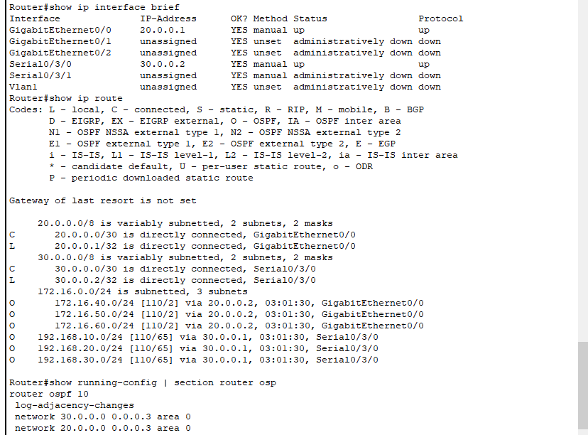

# enterprise-multisite-network-ospf-vlans

A multi-site enterprise network built in Cisco Packet Tracer using VLANs, EtherChannel, STP/RSTP, DHCP, SVIs, and OSPF.

## 🌐 Network Topology

## 🧪 Verification & Ping Tests

### Ping Test

### OSPF & Interface Status Verification

## 🛠️ Key Technologies & Features
- **Dynamic Routing**: Configured OSPF across multiple sites for efficient network connectivity.
- **VLANs & Trunking**: Network segmentation using 802.1Q trunking protocols.
- **Redundancy & High Availability**: EtherChannel link aggregation and Spanning Tree Protocol (STP/RSTP).
- **Inter-VLAN Routing**: Implemented Switched Virtual Interfaces (SVIs).
- **Core Services**: Centralized DHCP IP allocation.

## 🚀 How to Run
1. Download the `Enterprise-Network-Project.pkt` file.
2. Open it using **Cisco Packet Tracer**.

